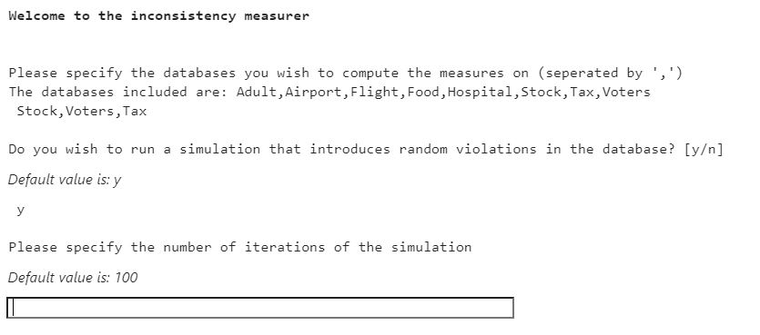

# Inconsistency-measurer

[This code belongs to our paper "Properties of Inconsistency Measures for Databases"](https://arxiv.org/abs/1904.06492)

This repository contains implementations of six database inconsistency measures.
* The dratic measure I_d - 1 if the database is inconsistent and 0 otherwise.
* The measure I_MI - the number of minimal inconsistent subsets.
* The measure I_P - the number of database tuples involved in a violation of the constraints.
* The measure I_R - the minimal number of tuples to remove from the database for the constraints to hold.
* The measure I^lin_R - the linear relaxation of I_R.
* The measure I_MC - the number of maximal consistent subsets of the database.

## Setup
To run this project, you will need to download :
1. Python 3.7 with Anaconda for Linux.
2. [Gurobi optimizer](https://www.gurobi.com/gurobi-and-anaconda-for-linux/) and a license.
3. The following step is essential for enabling user input to jupyterlab and displaying all the widgets.\
Install the latest version of Nodejs:
    1. ```bash
        sudo apt-get install nodejs
        ```
    2. ```bash
        sudo apt-get install npm
        ```
    3. ```bash
        nvm install v14.12.0
        ```
    Use the package manager [pip](https://pip.pypa.io/en/stable/) to install ipywidgets
    4. ```bash
        pip install ipywidgets
        ```
    5. ```bash
        jupyter nbextension enable --py widgetsnbextension
        ```
    6. ```bash
        jupyter labextension install @jupyter-widgets/jupyterlab-manager
        ```

## Installation
1. Download all project files. The folder should contain:
    * A Data folder containing a folder for each database
    * incorer.ipynb
    * ViolationsAlgorithm.py
    * README.md
    * a folder of images for the README instructions

2. Use the package manager [pip](https://pip.pypa.io/en/stable/) to install jupyterlab.
    ```bash
        pip install jupyterlab
    ```

3. Make sure to install all the required packages using [pip](https://pip.pypa.io/en/stable/):
    * pandas
    * gurobipy
    * numpy
    * pandasql
    * matplotlib
    * subprocess

4. Assuming Anaconda is already installed, the next step is to install the Gurobi package

    ```bash
     conda install gurobi
    ```
    Then, install the license through [Gurobi site](https://www.gurobi.com/documentation/9.0/quickstart_linux/retrieving_and_setting_up_.html#section:RetrieveLicense).
    
5. The following steps apply only if you wish to compute the I_MC measure. The measure is computed via an algorithm for enumerating maximal cliques in a graph. More information about the algorithm can be found in the [parallel_enum repository](https://github.com/veluca93/parallel_enum).
    * Download the parallel_enum repository into the folder and build the project as explained in the [parallel_enum repository](https://github.com/veluca93/parallel_enum).  
    * Make sure that the folder contains the "parallel_enum" project and the execution file "text_ui" exists in /parallel_enum/build/

## Usage
If you wish to compute the measures for the databases in the Data folder:
1. Open jupyter lab with
    ```bash
        jupyter lab
    ```
2. Locate the project folder
3. Open incorer.ipynb
4. Click on Run->Run all cells.
5. An input box will appear 
write the names of the databases you wish to compute the measures on, for example : Stock,Voters,Tax\
then, press ENTER
6. An input box will appear 
if you wish to run a simulation that adds random violations to the database and computes all the measures after each change to the database, write the letter n and press ENTER. If you only wish to compute the measures once on the given databases, write the letter y and press ENTER.
By default, the program will run the simulation.
7. An input box will appear in case you have chosen to run the simulation 
write the desired number of iterations for the simulation and press ENTER.
The algorithm will modify the database at each iteration and compute the values of the measures. By default the program will run the simulation for 100 iterations.
8. A check box list will appear 
choose the measures you wish to compute and read the instructions regarding the I_MC measure.
Then, click proceed.
9. The computation will begin 
A progress bar will show the progress of the program.
10. The results will appear in a new folder under the folder that contains the database 

If you wish to run the measures on a different database:
1. Create a new folder under Data with the desired database name.
Add the database into the new folder under the name inputDB.csv.
2. Import the constraints file to the folder under the name dcs.txt.
   * Each row in the file should contain a single denial constraint in the following format:
   not(t1.Longitude!=t2.Longitude&t1.Location=t2.Location)\
   not(t1.Open>t1.High)  

## Troubleshooting
* Q: The notebook does not display the widgets as they appear in the images, what should I do?\
  A: Please check that you have the latest version of NodeJs (v14.12.0 or higher)
  using the command
  ```bash
  node -v
  ```
* Q: I want to reset all my inputs , how can I do that?\
  A: Kernel->Restart Kernel and Clear all outputs.

* Q: When I choose to run the I_MC measure the program fails. What could be the reason?\
  A: Please make sure you that have built the parallel_enum project and you have a directory
  named "parallel_enum" which contains the directory "Build" with the file text_ui.
  For additional information please refer to [parallel_enum repository](https://github.com/veluca93/parallel_enum)

* Q: I have trouble with installing Gurobi, what could be the problem?\
  A: Please make sure that the python version you have installed is Python 3.7.


Good luck!
